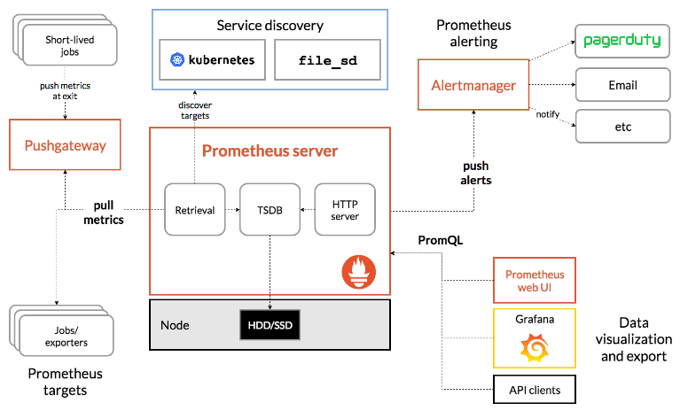

# Observability & Logging en AWS EKS Stack 2: Prometheus, Alermanager, Grafana, Loki, y Fluent Bit

## ☸️ Lista de herramientas y controladores de Kubernetes

📂 EBS CSI Driver (EKS Addon)

📊 Helm charts

🧑‍🏭 Prometheus Operator (using kube-prometheus-stack helm chart)

🔔 Alertmanager (using kube-prometheus-stack helm chart)

💻 Grafana (using kube-prometheus-stack helm chart)

🗃️ Loki (using grafana helm chart)

🔎 Promtail (using grafana helm chart)

## 📚 Historia

Instalar Prometheus Operator y Grafana en el clúster EKS.

Configure reglas de alerta, monitores de servicio y AlertManager para alertas por correo electrónico.

Instale Loki en el clúster EKS y configúrelo con AWS S3 para el almacenamiento de registros.

Instale Promtail en el clúster EKS y configúrelo para enviar registros a Loki.

Configure Grafana para mostrar los registros de la aplicación.

## ✅ Lista de servicios de AWS

👑 Amazon EKS

💻 Amazon EC2

🪣Amazon S3

## ☸️ Monitoreo
El monitoreo implica rastrear el rendimiento de su aplicación y sus recursos, y enviar alertas cuando algo funciona lentamente o falla, para evitar que los problemas se agraven.

📊 Prometheus:

Es una herramienta de monitoreo de código abierto que rastrea su carga de trabajo y almacena todas sus métricas en una base de datos de series de tiempo.Usamos PromQL para consultar las métricas En este blog, almacenaremos datos dentro de un volumen de AWS EBS.

📢 Alert manager:

Es un componente de Prometheus responsable de enviar alertas a los usuarios.

📜 Fluent-bit:

Fluent Bit es un procesador de logs rápido y flexible. compatible con varios sistemas operativos. Se utiliza para enrutar los logs a varios destinos de AWS, como Amazon CloudWatch, Amazon Kinesis Data Firehose, Amazon Simple Storage Service (Amazon S3) y Amazon OpenSearch, para esta POC recopila todos los registros de los contenedores y los envía a Loki.

🔗Loki: 

También es una herramienta de código abierto diseñada y desarrollada por Grafana Labs. Consume datos enviados por Promtail u otras herramientas, los procesa y los filtra.
Usamos LogQL para consultar los registros de Loki.
Loki se puede integrar con muchos servicios en la nube; en este blog usaremos el bucket AWS S3 para almacenar los registros.

🖥️Grafana:

Es una herramienta de visualización comúnmente utilizada para monitoreo y registro.
Grafana se puede integrar con Prometheus, Loki y muchas otras herramientas para crear un hermoso panel de control.
Grafana consultará a Prometheus y Loki para obtener las métricas y los registros.

🎯 Architecture:

  

Como puede ver en la arquitectura, Prometheus extrae métricas de la aplicación y el clúster y las almacena en volúmenes AWS EBS para mantenerlas persistentes en caso de falla del pod. De la misma manera, Grafana y Alermanger también almacenarán sus datos dentro del volumen EBS.

Promtail recopilará todos los registros de los nodos (registros de aplicaciones + registros de componentes) y enviará esos registros a Loki.

Loki agregará y procesará los registros y los enviará al depósito AWS S3.

Grafana consultará a Prometheus y Loki para obtener métricas y registros.

## 🚀 Guía paso a paso

🧑‍💻 Implementar la aplicación Nodejs

Inicializa una aplicación Express y configura el registro.

Métricas de Prometheus con prom-client: integra Prometheus para monitorear solicitudes HTTP utilizando la prom-clientbiblioteca:

- http_requests_total counter
- http_request_duration_seconds histogram
- http_request_duration_summary_seconds summary
- node_gauge_example gauge for tracking async task duration

Basic Routes:
- / : Returns a "Running" status.
- /healthy: Returns the health status of the server.
- /serverError: Simulates a 500 Internal Server Error.
- /notFound: Simulates a 404 Not Found error.
- /logs: Generates logs using the custom logging function.
- /crash: Simulates a server crash by exiting the process.
- /example: Tracks async task duration with a gauge.
- /metrics: Exposes Prometheus metrics endpoint.

Después de agregar las métricas necesarias, dockerice la aplicación y envíela al registro de contenedores. Se app/service.ymlcreará un LoadBalancer para exponer la aplicación en Internet. Aplique el archivo:

kubectl apply -k app/

Ahora, puedes tomar el nombre DNS del Load Balancer y visitar el sitio web.
Es bueno generar una carga mediante un script automatizado. En el directorio raíz, encontrará test.sh, que generará la carga enviando una gran cantidad de solicitudes.
Entonces, abra otra nueva terminal y ejecute el siguiente comando, tal como se muestra en la siguiente imagen.

kubectl get ingress

export YOUR_LOAD_BALANCER_DNS_NAME=k8s-default-ingressa-4b56d89fe8-1087330346.eu-west-1.elb.amazonaws.com

app/test.sh $YOUR_LOAD_BALANCER_DNS_NAME

- Nota: Continúe ejecutando el comando test.sh y no cierre la terminal por un momento.

## ⚓ Instalar el gráfico Helm

helm repo add prometheus-community https://prometheus-community.github.io/helm-charts

helm repo add grafana https://grafana.github.io/helm-charts

helm repo update

## ⚒️ Instalar y configurar Grafana + Prometheus + Alertmanager:

Ahora, instalemos el operador Prometheus en el clúster AWS EKS usando el gráfico Helm.

kubectl create ns observability

helm search repo kube-prometheus-stack --versions | grep v0.75.0

helm show values prometheus-community/kube-prometheus-stack --version=61.3.0 > observability_stack_values.yaml

helm install observability-stack prometheus-community/kube-prometheus-stack --version=61.3.0 -n observability -f prometheus/custom_observability_stack_values.yaml

helm upgrade -i observability-stack prometheus-community/kube-prometheus-stack --version=61.3.0 -n observability -f prometheus/custom_observability_stack_values.yaml

kubectl -n observability get service
kubectl -n observability get pods -l "release=observability-stack"

Es hora de aplicar todas estas configuraciones. Ejecute el siguiente comando
kubectl apply -k monitoring-k8s-stack-helm/
kubectl apply -f kustomization.yml

Necesitamos esperar un par de minutos para que el operador de Prometheus recargue su configuración.

## 🚀 Visite la interfaz de Grafana 

kubectl port-forward -n observability service/observability-stack-grafana 8080:80
http://localhost:8080

Verá muchos paneles de control predefinidos. Puede utilizarlos para realizar un seguimiento o diseñar o importar los suyos propios.

Importe el panel que creé para la aplicación Node.js, disponible en el grafana-dashboard directorio

Haga clic en el New botón de la parte superior derecha, seleccione Importen el menú desplegable e importe el panel.

Importe el panel de la comunidad escribiendo 315 y seleccionando Loki como fuente de datos.

Guia de alertas:
- https://samber.github.io/awesome-prometheus-alerts/rules#kubernetes

Visualizar contraseña de admin:

kubectl -n observability get secret observability-stack-grafana -o jsonpath="{.data.admin-password}" | base64 --decode ;echo
- prom-operator
kubectl -n observability get secret observability-stack-grafana -o jsonpath="{.data.admin-user}" | base64 --decode ;echo
- admin

Cargar Datasources y dashboards:

kubectl create secret generic datasources-secret -n observability --from-file=grafana/datasources/datasources.yaml

kubectl delete secret datasources-secret -n observability

kubectl label secret datasources-secret -n observability grafana_datasource=1

cd grafana/dashboards

ls -1 *.json | sed 's/\.[^.]*$//' | xargs -I {arg} kubectl create configmap -n observability --from-file={arg}.json {arg}-dashboard-cm

kubectl get configmaps -n observability | grep dashboard-cm | awk '{print $1}' | xargs -I {arg} kubectl label cm {arg} -n observability grafana_dashboard=1

kubectl get cm,secret -n observability --show-labels | grep -E "NAME|dashboard-cm|datasource"

## 🚀 Visite la interfaz de usuario de Prometheus:

kubectl port-forward -n observability service/prometheus-operated 9090:9090
- http://localhost:9090

Para consultar las reglas aplicadas, haga clic en el Alertsbotón de la parte superior.

Es hora de configurar alertas personalizadas, un Alertmanager para recibir correos electrónicos y un ServiceMonitor para recopilar las métricas de nuestra aplicación.

Antes de configurar Alertmanager, necesitamos credenciales para enviar correos electrónicos estoy usando Gmail, pero se puede usar cualquier proveedor SMTP como AWS SES. Así que obtengamos las credenciales para eso.
Abra la configuración de su cuenta de Google y busque App password y cree una nueva contraseña.

Convierte esa contraseña al formato base64.
Generar token de aplicación: 
- https://support.google.com/accounts/answer/185833?hl=es&sjid=17517275735111420684-SA
- https://www.base64encode.org/

datasource: 
    - http://prometheus-server.observability.svc.cluster.local

## 🚀 Visite la interfaz de usuario de Alertmanager:

kubectl port-forward -n observability service/alertmanager-operated 9093:9093
- http://localhost:9093

Haga clic en el Status botón de la parte superior para ver las configuraciones aplicadas.

Ahora, bloqueemos la aplicación Node.js dos veces para recibir alertas de Alertmanager.
La aplicación Nodejs tiene una ruta /crash que bloquea el contenedor y Kubernetes lo reinicia automáticamente. Sin embargo, si la aplicación se bloquea más de 2 veces, Alertmanager enviará una alerta a nuestro correo electrónico.
Vamos a verlo en la práctica

http://YOUR_LOAD_BALANCER_DNS_NAME/crash

kubectl get pods

### Desglose de los campos de alerta:

alert:  El nombre de la alerta ( KubernetesPodNotHealthy).

expr: expresión de Prometheus que se evaluará. Esta alerta se activa si se detecta algún pod en un estado: Pending, Unknown, Failed

for: la duración durante la cual la condición debe ser verdadera antes de que se active la alerta (1m or 1 minute).

labels: etiquetas adicionales para categorizar la alerta. En este caso, la etiquetamos con una gravedad de critical.

annotations: información descriptiva sobre la alerta. Estos campos pueden brindar contexto cuando se activa la alerta

— — summary: Una breve descripción de la alerta (Kubernetes Pod not healthy (instance {{ $labels.instance }})).

— — description: Una descripción detallada que incluye valores dinámicos de las etiquetas de alerta: (Pod {{ $labels.namespace }}/{{ $labels.pod }} has been in a non-running state for longer than 15 minutes.\n VALUE = {{ $value }}\n LABELS = {{ $labels }}).

## 🚀 Visite la interfaz de usuario de Prometheus

Compruebe la alerta en el estado de activación ejecutando, Verifique que Alertmanager recibió una alerta de Prometheus:

kubectl port-forward -n observability service/prometheus-operated 9090:9090

Nota: 
- Debería recibir una notificación por correo electrónico en su dirección de correo configurada.
- Lo configuramos para enviar correos electrónicos cada 5 minutos hasta que se resuelva el problema.

## ⚒️ Instalación de Loki

Hemos configurado la monitorización, ahora configuremos Loki.
Ya agregamos el repositorio de Grafana Helm en el paso anterior, que incluye tanto a Loki como a Promtail.

Queremos que Loki almacene registros en un depósito AWS S3, por lo que necesita un depósito y los permisos pertinentes para enviar registros al depósito AWS S3.

Dirígete a la consola AWS S3 y crea un depósito con un nombre único.

A continuación, crea una política de IAM en la consola de AWS. Puedes encontrar la política en loki/aws-s3-policy.json, pero recuerda agregar el ARN de tu bucket.

Vamos a crear un rol de IAM, adjuntar la política y crear un access_key_id y secret_access_key

Ahora estamos listos para configurar Loki:

helm search repo grafana/loki-distributed --versions | grep 2.9.6

helm show values grafana/loki-distributed --version=0.79.0 > loki/loki_distributed_values.yaml

- Nota: custom_loki_distributed_values.yml Tiene todas las configuraciones predeterminadas, pero tenemos que hacer algunos cambios para configurar el bucket AWS S3.
- Asegúrese de agregar el nombre de su depósito, la región, el ID de acceso y el ID de acceso secreto.

helm install loki grafana/loki-distributed --version=0.79.0 --namespace=observability 

helm upgrade -i loki grafana/loki-distributed --version=0.79.0 --namespace=observability

Ahora, importe el panel de la comunidad escribiendo 15141 y seleccionando Loki como fuente de datos.

Ahora, sigamos adelante y veamos nuestros registros en el panel de Grafana.

Antes de agregar un nuevo panel, necesitamos agregar nuevas fuentes de datos para que Grafana pueda consultar registros de Loki.

datasource: http://loki-loki-distributed-gateway.observability.svc.cluster.local

## ⚒️ Instalación de Fluent-Bit

Ahora, configuremos el recopilador de registros, Fluent-Bit. 

helm repo add fluent https://fluent.github.io/helm-charts

helm repo update

helm search repo fluent/fluent-bit --versions | grep 2.0.8

helm show values fluent/fluent-bit --version=0.22.0 > fluent_bit_values.yml

Tenemos que cambiar OUTPUT S3 el atributo para que fluent-bit sepa dónde enviar los registros. Consulta la imagen como referencia, También proporcioné un archivo de configuración actualizado fluent-bit/custom_fluent_bit_values.yml

helm install fluent-bit fluent/fluent-bit --version=0.22.0 --namespace=observability -f fluent-bit/custom_fluent_bit_values.yaml

helm upgrade --install fluent-bit fluent/fluent-bit --version=0.22.0 --namespace=observability -f fluent-bit/custom_fluent_bit_values.yaml

Documentacion oficial: https://docs.fluentbit.io/manual/v/2.0/pipeline/outputs/loki

Test de conectividad desde un pod cualquiera hacia el pod de loki (loki-loki-distributed-gateway):

- curl -X POST "loki-loki-distributed-gateway.observability.svc.cluster.local/loki/api/v1/push"
- curl -X PUT "loki-loki-distributed-gateway.observability.svc.cluster.local/loki/api/v1/push"
 - curl -X GET "loki-loki-distributed-gateway.observability.svc.cluster.local/loki/api/v1/push"

Para entender cómo se tratan los logs como streams, necesitamos comprender qué es el STDOUT y STDERR. En Linux, cada proceso tiene tres descriptores de archivo estándar: STDIN, STDOUT y STDERR. STDIN es la entrada estándar, desde donde un proceso lee su entrada. STDOUT es la salida estándar, donde un proceso escribe su salida. STDERR es la salida de error estándar, donde un proceso escribe sus mensajes de error.

Ahora, intentemos generar registros desde su aplicación seleccionando el default espacio de nombres en el menú desplegable en la parte superior.
Puede ejecutar ese test.sh script o visitarlo http://YOUR_LOAD_BALANCER_DNS_NAME/logsen el navegador.

Por último, verifique que fluent-bit esté enviando registros al depósito S3 verificando las carpetas creadas por Loki en la consola AWS S3.

## 🧼 Limpieza

kubectl delete -k app/
helm uninstall observability-stack -n observability
helm uninstall loki -n observability
helm uninstall fluent-bit -n observability
kubectl delete ns observability
kubectl get pv -n observability # eliminar en caso que exista